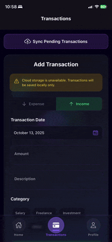
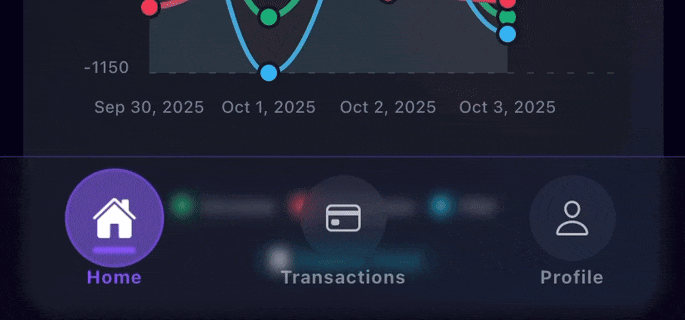

# 💰 Monevo - Finance Tracker App

<p align="center">
  
  
  
  
  
</p>

---

Monevo is a full-stack **Finance Tracking App** designed to help you monitor your income, expenses, and savings with style and efficiency.  
It features a **highly animated, custom glass-effect UI** in the frontend and a robust **Express.js + Oracle** backend for secure data handling. 🚀

---

## ✨ Features

- 📱 **Mobile-first interface** built with **Expo React Native**
- 🎨 **Custom animated UI** with **glass-effect styling**
- 🔐 Secure user authentication and session management
- 📊 Track **expenses, incomes, and categories**
- 🕒 Real-time updates between frontend and backend
- 💾 **Local SQLite database** and **AsyncStorage** support for offline usage
- 🌐 **RESTful API** backend with **Express.js** and **Oracle database**
- ⚡ Smooth, interactive animations for a premium user experience

---

### Clone the repository

```bash
git clone https://github.com/LihinduPerera/monevo.git
```

### Frontend
```bash
cd frontend
npm i
npx expo start
```

### Backend
```bash
cd backend
npm i
npm start
```

